<!--
  majedahdab2005 / profile README
  built green on purpose. if you are reading the source, hi.
  stack: hand written SVG, no templates, no generators.
-->

  

  
  
  
  
  
  



> I run the outside of the company and the front of the product.
>
> **Communication** is mine: clients, partners, and every external thread Kagu pulls.
> **Design, frontend and UX** are mine: if it has a surface, it goes through me before it goes live.
> Under that I am still full stack. Backend, data, infra, whatever the ship date needs.





<table>
  <tr>
    <td width="50%" valign="top">
      <a href="https://github.com/KaguSoftware/TouchPadel"></a>
    </td>
    <td width="50%" valign="top">
      <a href="https://github.com/KaguSoftware/KaguOs"></a>
    </td>
  </tr>
  <tr>
    <td width="50%" valign="top">
      <a href="https://github.com/KaguSoftware/Real-Estate-Manager"></a>
    </td>
    <td width="50%" valign="top">
      <a href="https://github.com/KaguSoftware/UpperDeck"></a>
    </td>
  </tr>
  <tr>
    <td width="50%" valign="top">
      <a href="https://github.com/KaguSoftware/Kagu-website"></a>
    </td>
    <td width="50%" valign="top">
      <a href="https://github.com/KaguSoftware"></a>
    </td>
  </tr>
</table>


  
  

  

  



  
  
  
  

  <code>designed, drawn and shipped by me. every pixel on this page is hand written SVG.</code>

