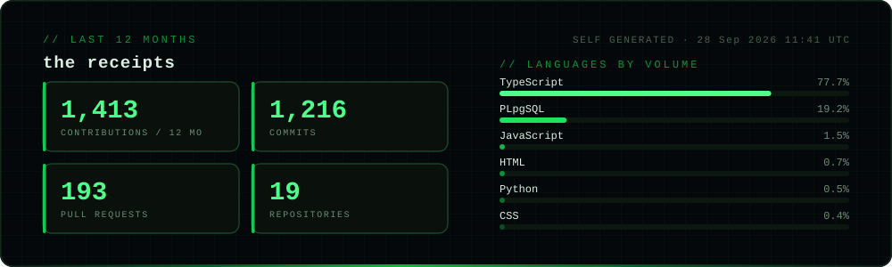

<!--
  majedahdab2005 / profile README
  green on purpose, just quieter now. if you are reading the source, hi.
-->

```
majed@kagu:~$ whoami
```

# Majed Ahdab

**Software Engineer and co-founder of [Kagu Software](https://kagusoftware.com).** Head of Design, Frontend and UX, and Head of Communication. Full-stack underneath.

Istanbul, TR · EN / TR / AR · Software Engineering at Bahcesehir University, class of '27

<a href="https://kagusoftware.com"></a>
<a href="https://github.com/KaguSoftware"></a>
<a href="mailto:majedahdab.kagu@gmail.com"></a>

I run the outside of the company and the front of the product.

**Communication** is mine: clients, partners, and every external thread Kagu pulls. **Design, frontend and UX** are mine: if it has a surface, it goes through me before it goes live. Under that I am still full stack. Backend, data, infra, whatever the ship date needs.

```json
{
  "owns": {
    "communication": "clients, partners, every external thread the company pulls",
    "design": "brand and product visual language, end to end",
    "frontend": "every interface that ships, ships through me",
    "ux": "nothing goes live without a UX pass"
  },
  "but_also": "full-stack, throw anything at me",
  "status": "building · shipping · repeat"
}
```

## // stack

Mobile first, idea to store on one stack: **React Native · Expo + EAS · Supabase · RevenueCat · Expo Push**

Also in the toolbox: TypeScript, Next.js 16, React 19, Tailwind v4, Postgres with RLS, Electron, Turborepo, Vercel, Node, Figma, i18n and RTL, Zod, Vitest.

## // selected work

| | Project | What it is | Stack |
|---|---|---|---|
| 01 | [TouchPadel](https://github.com/KaguSoftware/TouchPadel) | Padel venue OS in Iraq: booking app, QR cafe ordering and a Windows operator desk. EN / AR, full RTL. | React Native, Expo, Next.js, Electron, Supabase |
| 02 | [Kagu OS](https://github.com/KaguSoftware/KaguOs) | The company's own internal operating system. Clients, projects and delivery all run through it. | Next.js, TypeScript, Vercel |
| 03 | [Real Estate Manager](https://github.com/KaguSoftware/Real-Estate-Manager) | Multi-tenant SaaS for Turkish agencies: listings, leads, leases, rent and client-ready PDF contracts. | Next.js 16, React 19, Supabase, RLS, Zod |
| 04 | [UpperDeck](https://github.com/KaguSoftware/UpperDeck) | Digital menu and POS for a diner: mobile menu with call-a-waiter bell, staff roles and Telegram alerts. | Next.js, Tailwind v4, Supabase, Telegram API |
| 05 | [Kagu website](https://github.com/KaguSoftware/Kagu-website) | kagusoftware.com, the studio's own front door. Design, copy and build, start to finish. | Next.js, TypeScript, Motion |
| 06 | [The rest of it](https://github.com/KaguSoftware) | Everything else we ship lives in the org: client work, internal tools, experiments. | |

## // metrics



## // contact

Got something to build?

| | |
|---|---|
| Personal mail | [majedahdab.kagu@gmail.com](mailto:majedahdab.kagu@gmail.com) |
| Company mail | [contact@kagusoftware.com](mailto:contact@kagusoftware.com) |
| WhatsApp | [+90 552 346 44 32](https://wa.me/905523464432) |
| Phone | +90 553 553 17 92 |
| Web | [kagusoftware.com](https://kagusoftware.com) |
| Location | Istanbul, Turkiye (GMT+3) |

```
majed@kagu:~$ ./say-hello
```
